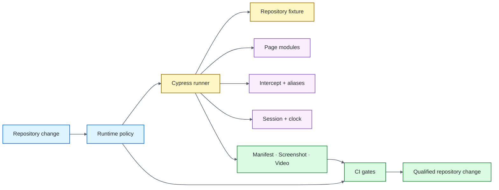

# Cypress UI Quality Engineering Framework

[](https://github.com/portyu9/qa-automation-ui-cypress/actions/workflows/ci.yml)
[](https://github.com/portyu9/qa-automation-ui-cypress/actions/workflows/extended.yml)
[](https://github.com/portyu9/qa-automation-ui-cypress/actions/workflows/security.yml)
[](https://github.com/portyu9/qa-automation-ui-cypress/actions/workflows/docs.yml)

[](https://nodejs.org/)
[](https://developer.mozilla.org/docs/Web/JavaScript)
[](https://www.cypress.io/)
[](https://www.google.com/chrome/)
[](https://www.mozilla.org/firefox/)
[](https://github.com/features/actions)
[](https://trivy.dev/)
[](LICENSE)
[](.github/SECURITY.md)

A Cypress browser quality-engineering framework centered on **native command retryability, explicit test isolation, stable application-owned selectors, deterministic target ownership, bounded evidence, and reproducible CI**. Page modules and custom commands add durable feature/test policy without hiding Cypress command-queue semantics.

> [!IMPORTANT]
> Required CI uses the repository-owned loopback application at `http://127.0.0.1:3100`. A deployed environment is selected explicitly with `CYPRESS_BASE_URL`; public-site availability is never part of framework health.

**Start here:** [capabilities](#capabilities) · [architecture](#architecture) · [quick start](#quick-start) · [repository map](#repository-map) · [documentation](#documentation)

## Capabilities

| Plane | Purpose | Primary evidence |
| --- | --- | --- |
| Runtime contract | Configuration, reporter, evidence, workflow-pin policy | Node self-tests + exit status |
| Primary browser | Authentication and page transitions | Chrome + reconciled manifest/screenshots/video |
| Native command orchestration | Interception, tasks, sessions, request setup, controlled clocks | Cypress command/assertion output |
| Browser/runtime compatibility | Change one compatibility dimension at a time | Firefox / maintenance-LTS evidence |
| Controlled dependency | UI behavior under explicitly owned network conditions | Native `cy.intercept()` evidence |
| Security | SAST, advisories, repository/configuration/secret, dependency-diff risk | CodeQL, npm Audit, Trivy, Dependency Review |
| Documentation | README/workflow/governance consistency | Documentation contract status |

## Architecture



Cypress owns **command scheduling, retryability, navigation, assertions, and browser state**; Node events own **fixture/process/evidence lifecycle**; page modules own **feature intent**. See [`docs/ARCHITECTURE.md`](docs/ARCHITECTURE.md) for the full lifecycle and evidence model.

## Quick start

```bash
npm ci --ignore-scripts
npm run cypress:install
npm run config:check
npm run cypress:verify
npm run test:chrome
```

No application process is required for the default run; Cypress owns the fixture lifecycle.

```bash
# browser compatibility
npm run test:firefox

# explicit deployed integration target
CYPRESS_BASE_URL=https://test.example.internal npm run test:chrome
```

For runtime variables, target classes, native command capabilities, synchronization, network/cross-origin policy, evidence/security, dependencies, and triage, see [`docs/OPERATIONS.md`](docs/OPERATIONS.md).

## Repository map

```text
.
├── .github/
├── config/
├── cypress/
├── docs/
└── fixture/
```

## Engineering contracts

- **Deterministic target:** required browser gates use the repository fixture rather than a public site.
- **Native queue ownership:** helpers return/enqueue Cypress commands rather than inventing another async model.
- **Stable selectors:** application-owned `data-test` hooks are the primary automation interface.
- **Observable synchronization:** retryable queries/assertions, network completion, browser state, or controlled time replace elapsed-time guessing.
- **Explicit isolation:** `testIsolation: true`; predecessor state is never a hidden prerequisite.
- **Validated reuse:** `cy.session()` carries an executable `validate()` contract when cached state matters.
- **Controlled time:** `cy.clock()`/`cy.tick()` own timer behavior instead of real waits.
- **Bounded evidence:** required lanes reconcile aggregate/per-test state, reject disabled tests and retry-recovered passes, and retain only reviewed structured evidence.
- **Separate integration:** non-default `CYPRESS_BASE_URL` runs are environment signals, not replacements for deterministic CI.

## Stable CI conclusions

| Stable status | Responsibility |
| --- | --- |
| `ci-gate` | Runtime/reporter/workflow-pin validation plus primary Chrome browser evidence |
| `extended-gate` | Browser and maintenance-LTS runtime compatibility |
| `security-gate` | Supply-chain policy, CodeQL, npm Audit, Trivy, and Dependency Review when available |

Workflow definitions: [`ci.yml`](.github/workflows/ci.yml) · [`extended.yml`](.github/workflows/extended.yml) · [`security.yml`](.github/workflows/security.yml) · [`docs.yml`](.github/workflows/docs.yml).

## Documentation

| Guide | Use it for |
| --- | --- |
| [`docs/ARCHITECTURE.md`](docs/ARCHITECTURE.md) | Runtime, fixture, command/state, reporter, evidence, compatibility, supply-chain boundaries |
| [`docs/TEST_STRATEGY.md`](docs/TEST_STRATEGY.md) | Layer selection, browser/runtime policy, isolation, negative testing, security, exit criteria |
| [`docs/OPERATIONS.md`](docs/OPERATIONS.md) | Commands, targets, runtime config, command queue, synchronization, network/cross-origin policy, CI, dependencies, triage |
| [`CONTRIBUTING.md`](CONTRIBUTING.md) | Change-quality expectations |

The deeper command/network/state flows and operating policy live in `/docs`; the main README intentionally retains only the architecture overview above.

## Design principle

Choose synchronization from **observable causal state**—DOM state, network completion, browser state, or controlled time—not elapsed-time guessing. A strong Cypress framework makes the failing boundary obvious: **runtime configuration, fixture lifecycle, command/network/state orchestration, navigation, browser/runtime compatibility, selector/readiness, application behavior, security, or explicit environment integration**.
