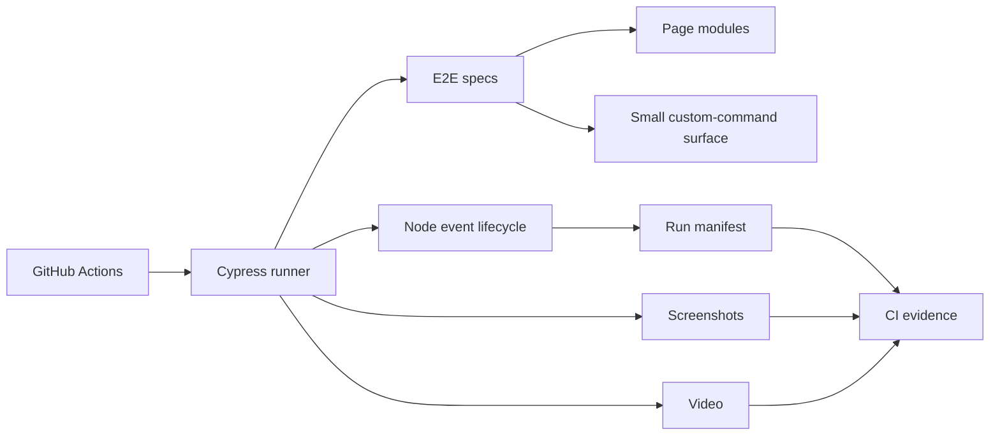
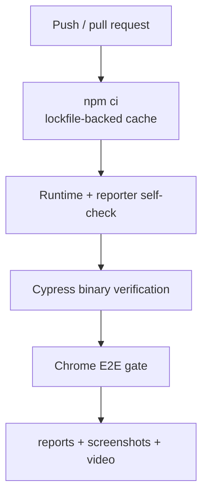

# Cypress UI Automation Framework

A Cypress end-to-end framework for browser workflows with validated runtime settings, page-oriented abstractions, stable selector contracts, native retryability, run-level diagnostics, and reproducible CI execution. The framework uses Cypress's own command queue and Node event lifecycle instead of introducing a second synchronization or reporting layer.

## Engineering contract

| Concern | Framework policy |
| --- | --- |
| Selectors | Prefer stable `data-test` contracts; avoid generated classes and DOM-depth selectors. |
| Synchronization | Rely on Cypress command/assertion retryability and observable network/UI state; fixed waits are not readiness checks. |
| Isolation | `testIsolation` remains enabled; tests must not require execution order or shared browser state. |
| Page abstractions | Feature-specific operations live in page modules; the global command surface stays intentionally small. |
| Sensitive values | Password typing disables Cypress command logging; credentials remain runtime/fixture concerns rather than diagnostics. |
| Retries | Run-mode retries are bounded and diagnostic, not a definition of correctness. |
| Evidence | Screenshots/video plus `reports/run-manifest.json` provide visual and structured failure context. |
| CI | Chrome is the primary gate, dependencies are installed with `npm ci`, and artifacts have bounded retention. |

## Architecture



## Repository layout

```text
.
├── config/
│   ├── runtime.js
│   ├── runReporter.js
│   └── runReporter.selftest.js
├── cypress/
│   ├── e2e/
│   ├── fixtures/
│   ├── pages/
│   └── support/
├── docs/
│   ├── ARCHITECTURE.md
│   └── TEST_STRATEGY.md
├── cypress.config.js
├── package.json
└── package-lock.json
```

## Quick start

Node.js 22+ is required.

```bash
npm ci
npm run config:check
npm run cypress:verify
npm run test:chrome
```

For local interactive work:

```bash
npm run cypress:open
```

`npm ci` is the normal dependency installation path. Use `npm install` only for intentional dependency changes and commit the updated lockfile with the manifest change.

## Commands

| Command | Purpose |
| --- | --- |
| `npm test` | Run the full suite headlessly with Cypress's default browser selection. |
| `npm run test:chrome` | Execute the CI-equivalent Chrome gate. |
| `npm run test:electron` | Execute the suite using bundled Electron. |
| `npm run test:login` | Run the focused login spec. |
| `npm run cypress:open` | Start the interactive Cypress runner. |
| `npm run cypress:verify` | Verify the installed Cypress binary. |
| `npm run config:check` | Load validated runtime config and execute the run-reporter contract self-test. |

## Runtime configuration

`config/runtime.js` validates Node-side runtime policy before the browser test begins.

| Variable | Purpose | Default |
| --- | --- | --- |
| `CYPRESS_BASE_URL` | Application base URL | `https://www.saucedemo.com` |
| `CYPRESS_COMMAND_TIMEOUT_MS` | Cypress command retry budget | `10000` |
| `CYPRESS_REQUEST_TIMEOUT_MS` | Request connection budget | `10000` |
| `CYPRESS_RESPONSE_TIMEOUT_MS` | Response wait budget | `30000` |
| `CYPRESS_PAGE_LOAD_TIMEOUT_MS` | Navigation/page-load budget | `60000` |
| `TEST_RUN_ID` | Cross-run diagnostic correlation | generated locally / CI run ID |

`.env.example` is documentation only. Inject environment-specific values through the shell or CI environment. Credentials should not be committed.

## Selector contract

The framework exposes `cy.getByTestId()` for stable `data-test` selectors. This is intentionally a small global abstraction because it enforces a real cross-application convention.

Prefer:

```js
cy.getByTestId('login-button').click();
```

Avoid selectors coupled to styling or document shape:

```js
cy.get('.btn.primary:nth-child(2)');
cy.get('main > div > div:nth-child(3) input');
```

A selector is part of the testability contract. It should survive CSS refactors that do not change user behavior.

## Synchronization model

Cypress commands and `.should()` assertions retry until the configured timeout. Use that behavior instead of fixed delays.

For network-driven transitions:

```js
cy.intercept('POST', '/api/orders').as('createOrder');
// trigger the action
cy.wait('@createOrder')
  .its('response.statusCode')
  .should('eq', 201);
cy.getByTestId('order-status').should('contain.text', 'Created');
```

This proves that the relevant request completed and the UI reached an observable state. `cy.wait(3000)` proves neither.

## Page modules and custom commands

Page modules own feature-specific locators and operations. Global custom commands are reserved for cross-cutting behavior that has a stable semantic contract.

Use a page module when the operation belongs to one feature:

```js
loginPage.login(username, password);
inventoryPage.assertLoaded();
```

Use a custom command only when the convention is genuinely framework-wide, such as stable test-id selection or carefully controlled authentication setup.

Do not build generic wrappers around `cy.click`, `cy.type`, or `cy.request`; those remove native Cypress context without enforcing additional policy.

## Isolation, sessions, and state

`testIsolation: true` is deliberate. Each test should establish the state it requires.

`cy.session()` is appropriate only when:

- setup is materially expensive;
- the cached session has an explicit validation function;
- reuse does not create cross-test business-state coupling;
- the behavior under test is not the authentication setup itself.

Stateful test data should be unique where the target application allows it. Shared static users can be acceptable for read-only/public examples but should not become a general production test-data strategy.

## Network stubbing

`cy.intercept()` should be used intentionally.

A useful stub can:

- force a deterministic dependency failure;
- validate an outbound request contract;
- isolate UI behavior from a service not under test;
- reproduce a rare response class.

Critical end-to-end paths should retain at least one real integration route. A suite in which every backend interaction is stubbed is a component test suite, not end-to-end coverage.

## Structured run manifest

The Node event layer registers Cypress's `after:run` event and writes:

```text
reports/run-manifest.json
```

The manifest includes:

- schema version and `TEST_RUN_ID`;
- configured base URL;
- browser name/version;
- operating system and Cypress version;
- aggregate tests/passed/failed/pending/skipped/duration;
- per-spec statistics;
- per-test final state, attempt count, and bounded final failure message.

The file is written through a temporary path and atomically renamed so CI does not retain partially serialized JSON after interruption.

`config/runReporter.selftest.js` validates the reporter mapping with a deterministic synthetic Cypress result object. That check runs as part of `npm run config:check`, so reporting infrastructure is tested without launching a browser.

## Evidence model

```text
Failure evidence
├── Cypress assertion/command log
├── screenshots/
├── videos/
└── reports/run-manifest.json
    ├── browser/platform/runtime
    ├── aggregate totals
    ├── per-spec stats
    └── final test attempt/error identity
```

Structured evidence is intended for CI triage and later automation. It does not replace Cypress's visual artifacts.

## CI topology



The workflow has read-only repository permissions, a bounded job timeout, branch-scoped concurrency cancellation, and bounded artifact retention.

## Failure triage

| Failure | First classification step |
| --- | --- |
| `config:check` fails | Fix invalid runtime values or reporter mapping before browser diagnosis. |
| Cypress binary verification fails | Runner/cache/binary issue, not application behavior. |
| Command times out | Inspect selector contract and observable application state; do not immediately increase timeout. |
| Intercept wait times out | Determine whether request was never sent, alias pattern is wrong, or dependency is stalled. |
| Test passes only on retry | Inspect state leakage, environment saturation, and transition synchronization. |
| Chrome-only failure | Compare browser-specific rendering/input behavior before weakening shared assertions. |
| Run manifest missing | Inspect Node event lifecycle/config loading; screenshots alone do not prove reporting health. |

## Extension rules

When extending the framework:

- add runtime values to `config/runtime.js` with validation;
- keep page behavior feature-specific;
- add custom commands only for stable cross-cutting conventions;
- test Node-side framework helpers without requiring Cypress where possible;
- use `after:run`/other supported Node events for operational reporting;
- keep generated reports under ignored artifact directories;
- preserve `testIsolation` unless a documented architectural reason requires otherwise;
- keep failure evidence bounded and free of credentials.

## Anti-patterns

The framework intentionally avoids:

- `cy.wait(number)` as synchronization;
- generated CSS classes and DOM depth as primary selectors;
- disabling test isolation to make ordering work;
- global commands for every page action;
- passwords typed with normal command logging;
- hiding failed Cypress exit codes in CI;
- unbounded reporter payloads;
- retry count increases used to hide nondeterminism;
- `npm install` in CI with a mutable dependency graph.

## Further design documentation

- [`docs/ARCHITECTURE.md`](docs/ARCHITECTURE.md) — browser, page, command, and Node-event boundaries.
- [`docs/TEST_STRATEGY.md`](docs/TEST_STRATEGY.md) — coverage selection, stubbing policy, reliability, and release gates.

The framework should make an end-to-end failure attributable to a **selector**, **application transition**, **network dependency**, **runner/runtime**, or **test-state** problem with minimal guesswork.
