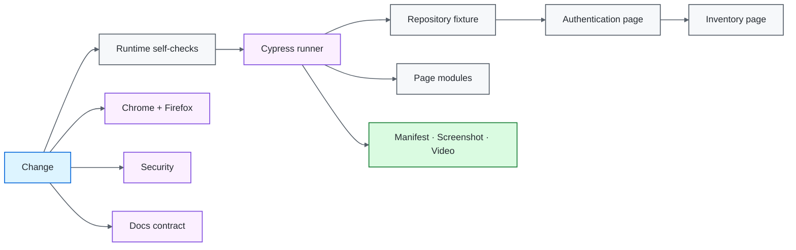

# Cypress UI Quality Engineering Framework

[](https://github.com/portyu9/qa-automation-ui-cypress/actions/workflows/ci.yml)
[](https://github.com/portyu9/qa-automation-ui-cypress/actions/workflows/extended.yml)
[](https://github.com/portyu9/qa-automation-ui-cypress/actions/workflows/security.yml)
[](https://github.com/portyu9/qa-automation-ui-cypress/actions/workflows/docs.yml)

[](https://nodejs.org/)
[](https://developer.mozilla.org/docs/Web/JavaScript)
[](https://www.cypress.io/)
[](https://www.google.com/chrome/)
[](https://www.mozilla.org/firefox/)
[](https://github.com/features/actions)
[](https://trivy.dev/)
[](LICENSE)
[](.github/SECURITY.md)

A Cypress browser quality-engineering framework built around native command retryability, explicit test isolation, stable `data-test` contracts, feature-oriented page modules, validated runtime configuration, deterministic application ownership, privacy-aware run diagnostics, and reproducible CI.

> [!IMPORTANT]
> Required CI does not depend on a public demonstration site. The default target is a repository-owned loopback application fixture. A real deployed environment can still be selected explicitly through `CYPRESS_BASE_URL` when integration coverage is intended.

## Capability map

| Plane | What it proves | Execution | Evidence |
| --- | --- | --- | --- |
| Runtime contract | Configuration and reporter mapping | Node self-tests | Process exit + assertions |
| Primary browser | Authentication acceptance/rejection and page transitions | Chrome / Node 22 | Run manifest, screenshots, video |
| Extended browser | Browser compatibility | Chrome + Firefox | Independent per-browser evidence |
| Controlled dependency | UI behavior under deterministic network conditions | `cy.intercept()` when justified | Native command/assertion output |
| Security | Dependency/configuration exposure | Trivy filesystem scan | JSON findings + Markdown summary |
| Documentation | README/workflow/governance consistency | Repository-local validator | Actions status |
| Observability | Run/browser/gate identity | Structured envelope + manifest | `reports/` + Actions summary |



## Engineering invariants

| Concern | Framework contract |
| --- | --- |
| Default target | Browser gates use `http://127.0.0.1:3100`, owned by the repository. |
| Fixture lifecycle | `setupNodeEvents` starts the local server only for the default target; `after:run` closes it. |
| External integration | A non-default `CYPRESS_BASE_URL` is explicit and does not redefine ordinary CI correctness. |
| Selectors | Stable `data-test` hooks are the primary UI test interface. |
| Synchronization | Cypress retryability and observable state replace fixed sleeps. |
| Isolation | `testIsolation: true`; no test depends on predecessor state. |
| Sensitive input | Password clear/type operations suppress Cypress command logging. |
| Negative behavior | Invalid credentials are a required executable contract. |
| Retries | Run-mode retries are bounded diagnostic policy, not the definition of correctness. |
| Reporting | `after:run` writes an atomic privacy-aware run manifest. |
| Reproducibility | Node 22+, committed lockfile, `npm ci`, Cypress binary verification. |
| Browser policy | Chrome is the primary gate; Firefox is the independent compatibility signal. |

## Tool ownership model

| Tool / technology | Native responsibility | Framework responsibility |
| --- | --- | --- |
| Cypress | Command queue, browser control, retryability, assertions, hooks, screenshots/video, test isolation | Runtime policy, page modules, fixture lifecycle, browser matrix, evidence contract |
| Node HTTP | Loopback request handling | Deterministic authentication/inventory fixture only |
| `cy.visit()` | Navigation and page-load/status semantics | Use without weakening native failure behavior |
| `data-test` | Stable application test hooks | Preferred locator contract |
| `cy.intercept()` | Request observation/stubbing | Controlled dependency scenarios, not blanket replacement of integration |
| Chrome / Firefox | Browser implementation | Primary-vs-extended execution policy |
| GitHub Actions | Job scheduling/artifact transport | CI separation, run correlation, retained evidence |
| Trivy | Supported vulnerability/misconfiguration analysis | HIGH/CRITICAL remediation gate |

## Repository map

```text
.
├── config/
│   ├── runtime.js
│   ├── runtime.selftest.js
│   ├── runReporter.js
│   └── runReporter.selftest.js
├── fixture/
│   └── server.js
├── cypress/
│   ├── e2e/
│   ├── fixtures/
│   ├── pages/
│   └── support/
├── docs/
│   ├── ARCHITECTURE.md
│   └── TEST_STRATEGY.md
├── .github/
│   ├── CODEOWNERS
│   ├── pull_request_template.md
│   ├── SECURITY.md
│   ├── scripts/validate_readme.py
│   └── workflows/
├── CONTRIBUTING.md
├── cypress.config.js
├── package.json
└── package-lock.json
```

## Quick start

```bash
npm ci
npm run config:check
npm run cypress:verify
npm run test:chrome
python .github/scripts/validate_readme.py
```

No application process has to be started manually for the default browser run. Cypress starts the repository fixture from the Node event lifecycle and closes it after the run.

Run Firefox compatibility:

```bash
npm run test:firefox
```

Run against an explicitly chosen environment:

```bash
CYPRESS_BASE_URL=https://test.example.internal npm run test:chrome
```

External targets should be controlled test environments. Public service uptime should not determine whether framework CI is healthy.

## Runtime configuration

`config/runtime.js` validates Node-side execution policy before browser work begins.

| Variable | Purpose | Default |
| --- | --- | --- |
| `CYPRESS_BASE_URL` | Application target | `http://127.0.0.1:3100` |
| `CYPRESS_COMMAND_TIMEOUT_MS` | Command/assertion retry budget | `10000` |
| `CYPRESS_REQUEST_TIMEOUT_MS` | Request connection budget | `10000` |
| `CYPRESS_RESPONSE_TIMEOUT_MS` | Response budget | `30000` |
| `CYPRESS_PAGE_LOAD_TIMEOUT_MS` | Page-load budget | `60000` |
| `TEST_RUN_ID` | Run/evidence correlation | generated locally / CI run ID |

URLs must be absolute HTTP(S), contain no URL credentials, and contain no query string or fragment. Invalid configuration fails before browser execution.

## Deterministic application fixture

`fixture/server.js` is intentionally small and application-specific. It provides:

- `/health` for fixture readiness;
- `/` with an authentication form and stable selector hooks;
- `/inventory.html` as the authenticated destination;
- deterministic valid and invalid credential behavior;
- no cookies, external APIs, third-party assets, DNS, or TLS dependencies.

The fixture is not a generic web framework and should not grow into a second application platform. Its purpose is to make browser-framework behavior deterministic: navigation, selectors, input handling, page transitions, negative behavior, screenshots/video, and cross-browser execution.

When `CYPRESS_BASE_URL` differs from the local default, Cypress does not start the fixture. This preserves an explicit path for deployed-environment integration without coupling it to the required build.

## Page modules and selectors

Page modules expose application intent rather than renaming Cypress commands. `LoginPage` owns authentication-page selectors/actions; `InventoryPage` owns authenticated inventory state.

Prefer:

```js
cy.get('[data-test="login-button"]').click();
cy.get('[data-test="inventory-item"]').should('have.length.at.least', 1);
```

Avoid styling and document-depth selectors that change for reasons unrelated to behavior.

## Synchronization model

Use Cypress queries and `.should()` assertions as the primary readiness mechanism. For request-driven behavior, synchronize to the actual request/response and then the UI state.

Do not use fixed numeric sleeps as readiness:

```js
cy.wait(3000); // elapsed time is not a system condition
```

A failure should identify which observable state never became true.

## Authentication contract

The browser suite executes both sides of the authentication boundary:

1. valid credentials navigate to `/inventory.html` and expose inventory items;
2. invalid credentials remain on `/` and expose the stable error `Invalid username or password`.

Passwords are typed with `{ log: false }`. This reduces command-log exposure; it does not make real credentials appropriate test data.

## Network stubbing policy

`cy.intercept()` is appropriate when the test specifically owns a controlled dependency condition, such as an error response, slow response, or outbound request-shape assertion. It should not be used to turn every browser test into a synthetic happy path.

Keep three scopes distinct:

- repository fixture: deterministic browser/framework contract;
- intercept-driven case: deterministic dependency condition;
- deployed target: explicit integration/environment contract.

## Evidence and run reporting

Cypress-native artifacts remain authoritative. `config/runReporter.js` adds a compact run-level manifest containing safe execution metadata. CI also writes an observability envelope with run ID, browser, commit/ref, target class, and final job status.

Retained evidence includes:

```text
reports/
├── run-manifest.json
├── ci-observability.json
└── ci-summary.md

cypress/
├── screenshots/
└── videos/
```

Do not add credentials, cookies, raw authorization headers, or arbitrary application payloads to shared run diagnostics.

## CI topology

Primary CI runs Chrome after runtime/reporter self-tests and Cypress binary verification. `extended.yml` runs Chrome and Firefox independently for browser/framework changes, pushes to `main`, schedule, and manual dispatch.

Each job has:

- least-privilege `contents: read` permissions;
- concurrency cancellation for superseded runs;
- a bounded runtime;
- run correlation;
- retained evidence;
- repository-owned browser target.

A browser-only failure remains a compatibility signal. Do not hide it by broadening retries or weakening assertions.

## Security and documentation governance

`.github/workflows/security.yml` runs Trivy filesystem vulnerability/misconfiguration analysis and preserves findings. `.github/workflows/docs.yml` validates repository-local documentation facts including local links, workflow badges, Mermaid declarations, governance files, and badge constraints.

Contribution/change expectations are documented in [`CONTRIBUTING.md`](CONTRIBUTING.md), with explicit ownership in [`.github/CODEOWNERS`](.github/CODEOWNERS).

## Failure triage

| Signal | First interpretation |
| --- | --- |
| Runtime self-test | Configuration/reporting contract |
| Fixture connection failure | Repository fixture lifecycle/port ownership |
| `cy.visit()` failure | Navigation/HTTP/page-load boundary |
| Selector timeout | UI contract/readiness |
| Invalid-login mismatch | Rejection/error semantics |
| Chrome-only or Firefox-only failure | Browser compatibility |
| Retry-only pass | Reliability defect |
| Security gate | Dependency/configuration risk |
| Docs gate | Repository documentation/governance drift |

## Extension rules

When adding a flow:

1. decide whether it belongs in the deterministic fixture or an explicit integration environment;
2. expose stable application-owned selectors;
3. keep state setup local to the test or a validated session boundary;
4. use observable state instead of sleeps;
5. add the negative path when rejection semantics matter;
6. keep sensitive inputs out of command logs and shared diagnostics;
7. update browser-matrix scope only when compatibility risk warrants it.

## Explicit anti-patterns

- required CI against a public demonstration website;
- fixed `cy.wait(number)` synchronization;
- disabling `testIsolation` to preserve predecessor state;
- styling/DOM-depth selectors as primary contracts;
- blanket `cy.intercept()` stubbing that removes the behavior under test;
- hidden authentication setup when authentication is itself under test;
- weakening native navigation/status failures;
- retries used to normalize unexplained flakiness;
- credentials or response bodies in generic evidence.

## Design references

- [`docs/ARCHITECTURE.md`](docs/ARCHITECTURE.md) — configuration, fixture, runner, page, and evidence boundaries.
- [`docs/TEST_STRATEGY.md`](docs/TEST_STRATEGY.md) — layer selection, browser policy, isolation, negative testing, and exit criteria.

A useful Cypress framework makes the failed boundary obvious: runtime configuration, fixture lifecycle, navigation, browser compatibility, selector/readiness, application behavior, or environment integration.