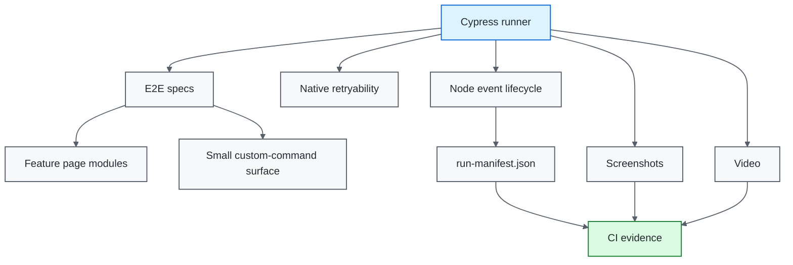
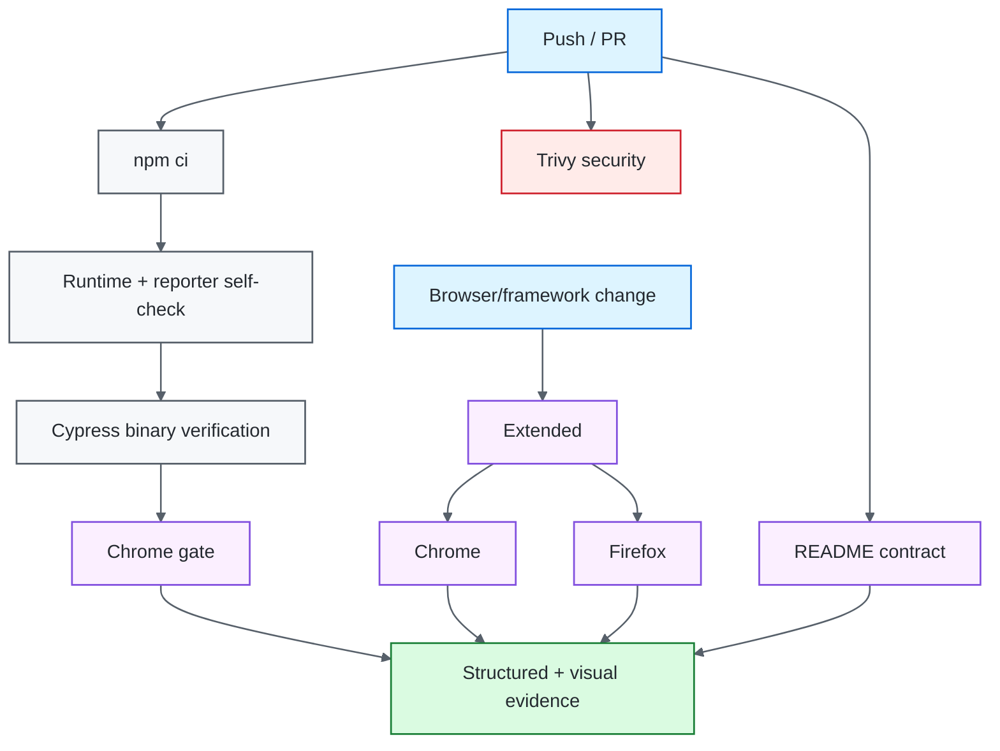

# Cypress UI Quality Engineering Framework

[](https://github.com/portyu9/qa-automation-ui-cypress/actions/workflows/ci.yml)
[](https://github.com/portyu9/qa-automation-ui-cypress/actions/workflows/extended.yml)
[](https://github.com/portyu9/qa-automation-ui-cypress/actions/workflows/security.yml)
[](https://github.com/portyu9/qa-automation-ui-cypress/actions/workflows/docs.yml)

[](https://nodejs.org/)
[](https://developer.mozilla.org/docs/Web/JavaScript)
[](https://www.cypress.io/)
[](https://www.google.com/chrome/)
[](https://www.mozilla.org/firefox/)
[](https://github.com/features/actions)
[](https://trivy.dev/)
[](LICENSE)
[](.github/SECURITY.md)

A Cypress browser quality-engineering framework built around native command retryability, explicit test isolation, stable `data-test` contracts, feature-oriented page modules, validated runtime configuration, privacy-aware run diagnostics, and reproducible CI. Framework code extends Cypress only where it enforces a durable policy; it does not replace Cypress's command queue with another synchronization layer.

> [!IMPORTANT]
> Cypress retryability is a condition-based synchronization engine, not permission to make tests vague. The test still needs an observable contract: the correct request, route, page state, element state, or domain outcome must become true within a bounded budget.

## Capability map

| Plane | What it proves | Execution | Evidence |
| --- | --- | --- | --- |
| Primary CI | Runtime contract + critical browser flows, including positive and negative login | Chrome / Node 22 | Run manifest, screenshots, video |
| Extended browser | Browser compatibility | Chrome + Firefox | Independent per-browser evidence |
| Component-style isolation | UI behavior under controlled backend responses | `cy.intercept()` when justified | Native command/assertion output |
| Security | Dependency/configuration exposure | Pinned Trivy filesystem scan | JSON findings + Markdown summary |
| Documentation contract | README links, workflow badges, Mermaid declarations, governance surfaces, badge palette | Repository-local Python stdlib validation | Actions status |
| Observability | Run/browser/gate identity | Structured envelope + run manifest | `reports/ci-observability.json`, Actions summary |

```mermaid
flowchart LR
    CHANGE[Change] --> CFG[Runtime + reporter self-check]
    CFG --> CH[Chrome primary gate]
    CHANGE --> SEC[Security gate]
    CHANGE --> DOCS[README contract]
    CHANGE -->|browser/framework paths| EXT[Extended]
    EXT --> C[Chrome]
    EXT --> F[Firefox]
    CH --> EV[Manifest · Screenshots · Video · Observability]
    C --> EV
    F --> EV
    SEC --> EV
    DOCS --> EV

    classDef entry fill:#ddf4ff,stroke:#0969da,color:#24292f,stroke-width:1.5px;
    classDef core fill:#f6f8fa,stroke:#57606a,color:#24292f,stroke-width:1.5px;
    classDef gate fill:#fbefff,stroke:#8250df,color:#24292f,stroke-width:1.5px;
    classDef evidence fill:#dafbe1,stroke:#1a7f37,color:#24292f,stroke-width:1.5px;
    classDef security fill:#ffebe9,stroke:#cf222e,color:#24292f,stroke-width:1.5px;
    class CHANGE entry;
    class CFG core;
    class CH,EXT,C,F,DOCS gate;
    class SEC security;
    class EV evidence;
    linkStyle default stroke:#57606a,stroke-width:1.4px;
```



## Engineering invariants

| Concern | Framework contract |
| --- | --- |
| Selectors | Prefer stable `data-test` contracts; styling classes and DOM depth are not primary test interfaces. |
| Navigation | `cy.visit('/')` retains Cypress's native bounded page-load and HTTP-status failure semantics; tests do not disable them to make a route appear healthy. |
| Synchronization | Use Cypress command/assertion retryability and observable network/UI state; fixed numeric waits are prohibited as readiness. |
| Isolation | `testIsolation` stays enabled; no test depends on predecessor state. |
| Page modules | Feature behavior belongs in page modules; the global custom-command surface stays intentionally small. |
| Sensitive input | Password clear/type operations suppress Cypress command logging. |
| Negative coverage | Invalid-login behavior executes as a first-class contract; it is not left skipped as decorative coverage. |
| Retries | Run-mode retries are bounded diagnostics, never the definition of correctness. |
| Reporting | `after:run` produces an atomic privacy-aware run manifest; reporter mapping is self-tested without a browser. |
| Reproducibility | Node 22+, committed lockfile, `npm ci`, Cypress binary verification. |
| Browser coverage | Chrome is the fast gate; Firefox is an independent extended signal. |
| Documentation | README-local references, workflow badges, Mermaid roots, governance files, and static badge-color uniqueness are executable contracts. |

## Tool ownership model

| Tool / technology | Native responsibility | Framework responsibility | Deliberately left visible |
| --- | --- | --- | --- |
| Cypress runner | Command queue, browser automation, retryability, assertions, hooks, screenshots/video, test isolation | Runtime validation, feature page modules, reporting contract, browser policy | Command log, retry behavior, native assertion failures and browser runner semantics |
| `cy.visit()` | Navigation, page-load deadline, status-code failure behavior | Use native behavior without disabling safety checks | Navigation/status failures remain observable rather than being converted into later selector timeouts |
| Cypress queries / `.should()` | Automatic retry of query/assertion chains | Express observable readiness contracts and bounded global budgets | The selector/assertion that timed out remains the diagnostic surface |
| `data-test` selectors | Application-provided stable testability hooks | Treat them as the preferred UI contract; inventory uses `[data-test="inventory-item"]` | Styling classes remain implementation detail rather than test API |
| `cy.intercept()` | Network observation/stubbing | Controlled dependency scenarios and outbound request assertions when the test's scope warrants it | The suite distinguishes stubbed UI isolation from a real integration path |
| `cy.session()` | Session caching with validation | Allowed only for expensive setup with an explicit validation contract | Authentication behavior under test is not hidden behind a cached session |
| Node event lifecycle | `setupNodeEvents`, `after:run`, browser-run result objects | Atomic run manifest mapping and privacy-aware summaries | Cypress result data remains the source of truth |
| Chrome / Firefox / Electron | Browser/runtime implementation | Primary, extended, and optional local execution policy | Browser-specific failures remain compatibility signals |
| Trivy | Filesystem vulnerability and supported misconfiguration analysis | HIGH/CRITICAL remediation-oriented gate and retained findings | Configured `vuln,misconfig` scan is not generic credential/secret scanning |
| GitHub Actions | Job scheduling, runner/browser environment, artifact transport | Primary/extended/security/docs separation and observability envelope | Native exit codes remain authoritative |

## Architecture



## Repository map

```text
.
├── config/
│   ├── runtime.js
│   ├── runtime.selftest.js
│   ├── runReporter.js
│   └── runReporter.selftest.js
├── cypress/
│   ├── e2e/
│   ├── fixtures/
│   ├── pages/
│   └── support/
├── docs/
│   ├── ARCHITECTURE.md
│   └── TEST_STRATEGY.md
├── .github/
│   ├── scripts/
│   │   └── validate_readme.py
│   └── workflows/
│       ├── ci.yml
│       ├── docs.yml
│       ├── extended.yml
│       └── security.yml
├── cypress.config.js
├── package.json
└── package-lock.json
```

## Documentation contract

`.github/workflows/docs.yml` validates repository-local documentation on every pull request and `main`: local Markdown targets, committed workflow badge targets, Mermaid declarations, root `LICENSE`, `.github/SECURITY.md`, unique static Shields colors, and the GitHub-dark `#24292F` Security Policy badge. External website uptime is deliberately excluded from this deterministic gate.

## Quick start

```bash
npm ci
npm run config:check
npm run cypress:verify
npm run test:chrome
python .github/scripts/validate_readme.py
```

Interactive diagnosis:

```bash
npm run cypress:open
```

Firefox compatibility:

```bash
npm run test:firefox
```

> [!NOTE]
> `npm ci` is the normal execution path. `npm install` is reserved for deliberate dependency changes that produce a reviewed manifest/lockfile diff.

<details>
<summary><strong>Command reference</strong></summary>

| Command | Purpose |
| --- | --- |
| `npm test` | Headless Cypress suite using default browser selection. |
| `npm run test:chrome` | Primary CI-equivalent Chrome gate. |
| `npm run test:firefox` | Firefox compatibility execution. |
| `npm run test:electron` | Bundled Electron execution. |
| `npm run test:login` | Focused login spec. |
| `npm run cypress:open` | Interactive runner. |
| `npm run cypress:verify` | Verify installed Cypress binary. |
| `npm run config:check` | Runtime + reporter self-tests and config loading. |

</details>

## Runtime configuration

`config/runtime.js` validates Node-side execution policy before Cypress begins browser work.

| Variable | Purpose | Default |
| --- | --- | --- |
| `CYPRESS_BASE_URL` | Application target | `https://www.saucedemo.com` |
| `CYPRESS_COMMAND_TIMEOUT_MS` | Command/assertion retry budget | `10000` |
| `CYPRESS_REQUEST_TIMEOUT_MS` | Request connection budget | `10000` |
| `CYPRESS_RESPONSE_TIMEOUT_MS` | Response budget | `30000` |
| `CYPRESS_PAGE_LOAD_TIMEOUT_MS` | Page-load budget | `60000` |
| `TEST_RUN_ID` | Run/evidence correlation | generated locally / CI run ID |

Runtime URLs are validated before browser execution. Invalid configuration is a framework failure, not a reason to increase Cypress timeouts.

## Selector contract

The global `cy.getByTestId()` command exists because it enforces a real, stable convention:

```js
cy.getByTestId('login-button').click();
```

Page modules follow the same contract directly where a dedicated property is clearer. The inventory collection uses `[data-test="inventory-item"]`, not `.inventory_item`; styling changes therefore do not redefine the test interface.

Avoid coupling tests to styling/document shape:

```js
cy.get('.btn.primary:nth-child(2)');
cy.get('main > div > div:nth-child(3) input');
```

## Navigation and sensitive input

`LoginPage.visit()` delegates to `cy.visit('/')` without `failOnStatusCode: false` or an unbounded page-load override. A failed HTTP navigation or page-load deadline therefore fails at the navigation boundary instead of drifting into a later locator timeout.

Password entry suppresses both clear and type command logging:

```js
this.password.clear({ log: false }).type(password, { log: false });
```

This reduces accidental exposure in Cypress command logs. It does not make screenshots, browser memory, application telemetry, or the target system safe for real credentials; test accounts/data should still be non-sensitive.

## Synchronization model

Cypress commands and `.should()` assertions retry until success or the configured deadline. For network-driven transitions, synchronize to the actual dependency event and then the observable UI state:

```js
cy.intercept('POST', '/api/orders').as('createOrder');
// trigger behavior
cy.wait('@createOrder')
  .its('response.statusCode')
  .should('eq', 201);
cy.getByTestId('order-status').should('contain.text', 'Created');
```

Avoid:

```js
cy.wait(3000);
```

A numeric wait cannot distinguish a healthy slow transition from a request that never happened.

## Test isolation and negative behavior

`testIsolation: true` is a framework invariant. Every test establishes its required state.

The login specification executes both the valid-credential route contract and the invalid-credential error contract. The negative case asserts that the application remains on `/` and exposes a non-empty visible error. It is not skipped, and CI therefore detects regressions in both acceptance and rejection behavior.

`cy.session()` is justified only when:

- setup is materially expensive;
- the cached session has an explicit validation contract;
- reuse does not share mutable business state;
- authentication setup itself is not the behavior under test.

Do not disable isolation to make ordering dependencies work.

## Network stubbing policy

`cy.intercept()` is appropriate when the requirement is UI behavior under a controlled dependency condition, for example:

- deterministic error states;
- outbound request-shape assertions;
- rare response classes;
- UI isolation from a dependency outside the scope of the test.

At least one critical path should retain a real integration route. If every backend interaction is stubbed, the suite is a browser component suite—not end-to-end coverage.

## Structured run manifest

The Node event layer uses supported Cypress `after:run` lifecycle data to write `reports/run-manifest.json`. It includes schema/run identity, sanitized target context, browser/platform/runtime, aggregate counts/duration, per-spec statistics, and per-test final state/attempt/failure metadata. Messages are bounded and sensitive URL components are removed.

The file is written to a temporary path and atomically renamed. `config/runReporter.selftest.js` validates mapping behavior with synthetic Cypress result data, so reporting infrastructure can fail fast without browser startup.

## Cross-browser strategy

Primary CI uses Chrome. `extended.yml` executes both Chrome and Firefox on browser/framework changes, `main`, schedule, and manual dispatch.

Each browser cell performs the runtime/reporter self-check, verifies the Cypress binary, runs the same suite through explicit browser selection, receives a browser-specific run ID, and uploads independent structured/visual evidence.

A Firefox-only failure is a compatibility signal. Analyze rendering, event/input, browser API, timing, or application behavior before weakening shared selectors/assertions.

## Security engineering

`.github/workflows/security.yml` runs open-source Trivy filesystem scanning. The action is pinned to immutable commit `ed142fd0673e97e23eac54620cfb913e5ce36c25` (`v0.36.0`) with Trivy engine `v0.74.0`.

The gate focuses on configured fixed HIGH/CRITICAL dependency vulnerabilities and HIGH/CRITICAL supported repository/configuration misconfigurations. JSON findings plus a Markdown count summary are retained under `reports/security/`. Its configured scanners are `vuln,misconfig`; this repository does not claim that workflow as generic credential/secret scanning.

## Observability and evidence

Primary CI emits:

```text
reports/
├── run-manifest.json
├── ci-observability.json
└── ci-summary.md
```

The observability envelope records framework identity, run ID, Node/browser dimension, final job state, commit SHA, and ref. The run manifest contains richer test-level detail; screenshots/video provide visual state.

```text
GitHub Actions run
└── TEST_RUN_ID
    ├── Cypress browser/runtime
    ├── per-spec/test manifest entries
    ├── screenshots/video
    └── CI observability envelope
```

No external analytics service is required. These artifacts are intentionally portable for later ingestion by open-source log/telemetry tooling.

## CI topology



## Failure triage

| Signal | First interpretation | First evidence |
| --- | --- | --- |
| `config:check` | Runtime/reporter contract | Node self-test output |
| Cypress verification | Binary/cache/runner | Cypress verification log |
| README contract | Documentation/governance drift | Validator output |
| `cy.visit()` failure | Navigation/status/page-load boundary | Native Cypress navigation output |
| Command timeout | Selector/application state | command log + screenshot |
| Intercept timeout | Request not sent/pattern/dependency | network alias behavior |
| Retry-only pass | State/timing/environment | first attempt + manifest |
| Firefox-only failure | Browser compatibility | per-browser artifacts |
| Missing run manifest | Node event lifecycle | config/reporter output |
| Trivy failure | Dependency/configuration risk | `trivy.json` |

## Extension rules

1. validate new runtime values in `config/runtime.js`;
2. keep native navigation/status failure semantics enabled;
3. keep feature operations in page modules;
4. add global commands only for stable cross-cutting conventions;
5. unit/self-test Node-side framework helpers without Cypress when possible;
6. use supported Node event hooks for operational reporting;
7. preserve `testIsolation`;
8. suppress sensitive-input command logging without treating it as complete secret protection;
9. keep diagnostics bounded and privacy-aware;
10. use network stubbing intentionally and document what integration it replaces;
11. expand browser coverage based on browser risk;
12. keep lockfile and CI dependency behavior reproducible;
13. update README contracts when a public command, workflow, tool responsibility, or evidence surface changes.

## Explicit anti-patterns

- `cy.wait(number)` as readiness;
- `pageLoadTimeout: 0` or disabled HTTP-status failure used to hide navigation defects;
- generated CSS classes/DOM depth as primary selectors when `data-test` exists;
- disabling isolation to make order dependence pass;
- skipped negative contracts that are expected to be supported;
- global custom commands for every page action;
- credentials typed with ordinary Cypress logging;
- hidden Cypress exit codes;
- unbounded reporter payloads;
- retry increases masking nondeterminism;
- `npm install` in CI;
- every backend request stubbed while calling the suite end-to-end;
- README claims or badge surfaces not backed by committed repository state.

## Design references

- [`docs/ARCHITECTURE.md`](docs/ARCHITECTURE.md) — browser, page, command, event, and evidence boundaries.
- [`docs/TEST_STRATEGY.md`](docs/TEST_STRATEGY.md) — coverage selection, stubbing, reliability, and browser policy.

> [!TIP]
> Cypress is strongest when tests express observable application contracts and let native retryability do the waiting. Extra abstraction should clarify ownership or enforce policy—not hide the command queue that makes failures debuggable.
