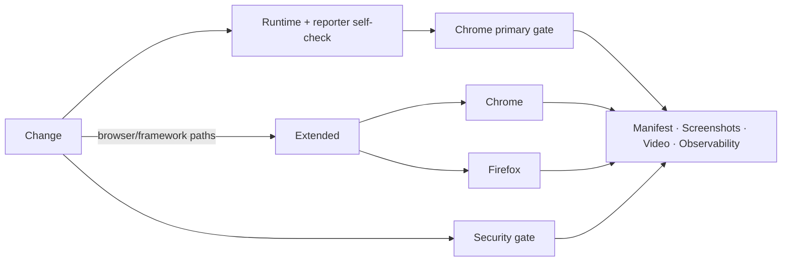
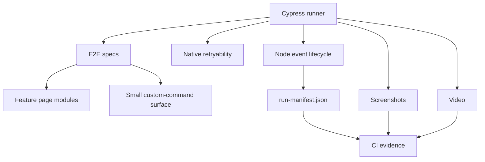
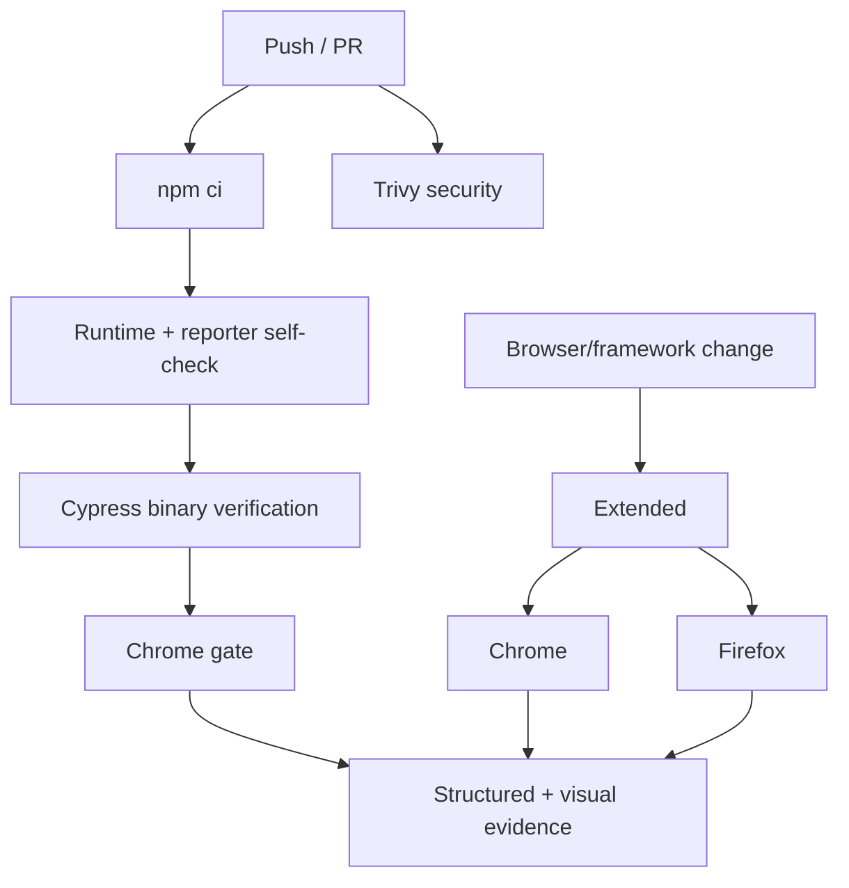

# Cypress UI Quality Engineering Framework

[](https://github.com/portyu9/qa-automation-ui-cypress/actions/workflows/ci.yml)
[](https://github.com/portyu9/qa-automation-ui-cypress/actions/workflows/extended.yml)
[](https://github.com/portyu9/qa-automation-ui-cypress/actions/workflows/security.yml)

A Cypress browser quality-engineering framework built around native command retryability, explicit test isolation, stable selector contracts, feature-oriented page modules, validated runtime configuration, structured run diagnostics, and reproducible CI. Framework code extends Cypress only where it enforces a durable policy; it does not replace Cypress's command queue with another synchronization or abstraction layer.

> [!IMPORTANT]
> Cypress retryability is a condition-based synchronization engine, not permission to make tests vague. The test still needs an observable contract: the correct request, page state, element state, route, or domain outcome must become true within a bounded budget.

## Capability map

| Plane | What it proves | Execution | Evidence |
| --- | --- | --- | --- |
| Primary CI | Runtime contract + critical browser flow | Chrome / Node 22 | Run manifest, screenshots, video |
| Extended browser | Browser compatibility | Chrome + Firefox | Independent per-browser evidence |
| Component-style isolation | UI behavior under controlled backend responses | `cy.intercept()` when justified | Native command/assertion output |
| Security | Dependency/configuration exposure | Pinned Trivy filesystem scan | JSON findings + Markdown summary |
| Observability | Run/browser/gate identity | Structured envelope + run manifest | `reports/ci-observability.json`, Actions summary |



## Engineering invariants

| Concern | Framework contract |
| --- | --- |
| Selectors | Prefer stable `data-test` contracts; styling classes and DOM depth are not primary test interfaces. |
| Synchronization | Use Cypress command/assertion retryability and observable network/UI state; fixed numeric waits are prohibited as readiness. |
| Isolation | `testIsolation` stays enabled; no test depends on predecessor state. |
| Page modules | Feature behavior belongs in page modules; the global custom-command surface stays intentionally small. |
| Sensitive input | Password entry suppresses Cypress command logging. |
| Retries | Run-mode retries are bounded diagnostics, never the definition of correctness. |
| Reporting | `after:run` produces an atomic privacy-aware run manifest; reporter mapping is self-tested without a browser. |
| Reproducibility | Node 22+, committed lockfile, `npm ci`, Cypress binary verification. |
| Browser coverage | Chrome is the fast gate; Firefox is an independent extended signal. |

## Architecture



## Repository map

```text
.
├── config/
│   ├── runtime.js
│   ├── runtime.selftest.js
│   ├── runReporter.js
│   └── runReporter.selftest.js
├── cypress/
│   ├── e2e/
│   ├── fixtures/
│   ├── pages/
│   └── support/
├── docs/
│   ├── ARCHITECTURE.md
│   └── TEST_STRATEGY.md
├── .github/workflows/
│   ├── ci.yml
│   ├── extended.yml
│   └── security.yml
├── cypress.config.js
├── package.json
└── package-lock.json
```

## Quick start

```bash
npm ci
npm run config:check
npm run cypress:verify
npm run test:chrome
```

Interactive diagnosis:

```bash
npm run cypress:open
```

Firefox compatibility:

```bash
npm run test:firefox
```

> [!NOTE]
> `npm ci` is the normal execution path. `npm install` is reserved for deliberate dependency changes that produce a reviewed manifest/lockfile diff.

<details>
<summary><strong>Command reference</strong></summary>

| Command | Purpose |
| --- | --- |
| `npm test` | Headless Cypress suite using default browser selection. |
| `npm run test:chrome` | Primary CI-equivalent Chrome gate. |
| `npm run test:firefox` | Firefox compatibility execution. |
| `npm run test:electron` | Bundled Electron execution. |
| `npm run test:login` | Focused login spec. |
| `npm run cypress:open` | Interactive runner. |
| `npm run cypress:verify` | Verify installed Cypress binary. |
| `npm run config:check` | Runtime + reporter self-tests and config loading. |

</details>

## Runtime configuration

`config/runtime.js` validates Node-side execution policy before Cypress begins browser work.

| Variable | Purpose | Default |
| --- | --- | --- |
| `CYPRESS_BASE_URL` | Application target | `https://www.saucedemo.com` |
| `CYPRESS_COMMAND_TIMEOUT_MS` | Command/assertion retry budget | `10000` |
| `CYPRESS_REQUEST_TIMEOUT_MS` | Request connection budget | `10000` |
| `CYPRESS_RESPONSE_TIMEOUT_MS` | Response budget | `30000` |
| `CYPRESS_PAGE_LOAD_TIMEOUT_MS` | Page-load budget | `60000` |
| `TEST_RUN_ID` | Run/evidence correlation | generated locally / CI run ID |

Runtime URLs are validated before browser execution. Invalid configuration is a framework failure, not a reason to increase Cypress timeouts.

## Selector contract

The global `cy.getByTestId()` command exists because it enforces a real, stable convention:

```js
cy.getByTestId('login-button').click();
```

Avoid coupling tests to styling/document shape:

```js
cy.get('.btn.primary:nth-child(2)');
cy.get('main > div > div:nth-child(3) input');
```

A stable selector is part of product testability. It should survive refactors that do not change user-visible behavior.

## Synchronization model

Cypress commands and `.should()` assertions retry until success or the configured deadline. For network-driven transitions, synchronize to the actual dependency event and then the observable UI state:

```js
cy.intercept('POST', '/api/orders').as('createOrder');
// trigger behavior
cy.wait('@createOrder')
  .its('response.statusCode')
  .should('eq', 201);
cy.getByTestId('order-status').should('contain.text', 'Created');
```

Avoid:

```js
cy.wait(3000);
```

A numeric wait cannot distinguish a healthy slow transition from a request that never happened.

## Test isolation and sessions

`testIsolation: true` is a framework invariant. Every test establishes its required state.

`cy.session()` is justified only when:

- setup is materially expensive;
- the cached session has an explicit validation contract;
- reuse does not share mutable business state;
- authentication setup itself is not the behavior under test.

Do not disable isolation to make ordering dependencies work.

## Network stubbing policy

`cy.intercept()` is appropriate when the requirement is UI behavior under a controlled dependency condition, for example:

- deterministic error states;
- outbound request-shape assertions;
- rare response classes;
- UI isolation from a dependency outside the scope of the test.

At least one critical path should retain a real integration route. If every backend interaction is stubbed, the suite is a browser component suite—not end-to-end coverage.

## Structured run manifest

The Node event layer uses supported Cypress `after:run` lifecycle data to write:

```text
reports/run-manifest.json
```

It includes schema/run identity, sanitized target context, browser/platform/runtime, aggregate counts/duration, per-spec statistics, and per-test final state/attempt/failure metadata. Messages are bounded and sensitive URL components are removed.

The file is written to a temporary path and atomically renamed. `config/runReporter.selftest.js` validates mapping behavior with synthetic Cypress result data, so reporting infrastructure can fail fast without browser startup.

## Cross-browser strategy

Primary CI uses Chrome. `extended.yml` executes both Chrome and Firefox on browser/framework changes, `main`, schedule, and manual dispatch.

Each browser cell:

- performs the runtime/reporter self-check;
- verifies the Cypress binary;
- runs the same suite through explicit browser selection;
- receives a browser-specific run ID;
- uploads independent structured/visual evidence.

A Firefox-only failure is a compatibility signal. It should be analyzed for rendering, event/input, browser API, timing, or application behavior before shared selectors/assertions are weakened.

## Security engineering

`.github/workflows/security.yml` runs open-source Trivy filesystem scanning. The action is pinned to immutable commit `ed142fd0673e97e23eac54620cfb913e5ce36c25` (`v0.36.0`) with Trivy engine `v0.74.0`.

The gate focuses on configured fixed HIGH/CRITICAL dependency vulnerabilities and HIGH/CRITICAL supported repository/configuration misconfigurations. JSON findings plus a Markdown count summary are retained under `reports/security/`.

## Observability model

Primary CI emits:

```text
reports/
├── run-manifest.json
├── ci-observability.json
└── ci-summary.md
```

The observability envelope records framework identity, run ID, Node/browser dimension, final job state, commit SHA, and ref. The run manifest contains richer test-level detail; screenshots/video provide visual state.

```text
GitHub Actions run
└── TEST_RUN_ID
    ├── Cypress browser/runtime
    ├── per-spec/test manifest entries
    ├── screenshots/video
    └── CI observability envelope
```

No external analytics service is required. These artifacts are intentionally portable for later ingestion by open-source log/telemetry tooling.

## Evidence model

```text
Failure evidence
├── Cypress assertion / command log
├── screenshots/
├── videos/
├── reports/run-manifest.json
│   ├── runtime/browser
│   ├── aggregate totals
│   └── final test attempt/error
└── reports/ci-observability.json
```

## CI topology



## Failure triage

| Signal | First interpretation | First evidence |
| --- | --- | --- |
| `config:check` | Runtime/reporter contract | Node self-test output |
| Cypress verification | Binary/cache/runner | Cypress verification log |
| Command timeout | Selector/application state | command log + screenshot |
| Intercept timeout | Request not sent/pattern/dependency | network alias behavior |
| Retry-only pass | State/timing/environment | first attempt + manifest |
| Firefox-only failure | Browser compatibility | per-browser artifacts |
| Missing run manifest | Node event lifecycle | config/reporter output |
| Trivy failure | Dependency/configuration risk | `trivy.json` |

## Extension rules

1. validate new runtime values in `config/runtime.js`;
2. keep feature operations in page modules;
3. add global commands only for stable cross-cutting conventions;
4. unit/self-test Node-side framework helpers without Cypress when possible;
5. use supported Node event hooks for operational reporting;
6. preserve `testIsolation`;
7. keep diagnostics bounded and privacy-aware;
8. use network stubbing intentionally and document what integration it replaces;
9. expand browser coverage based on browser risk;
10. keep lockfile and CI dependency behavior reproducible.

## Explicit anti-patterns

- `cy.wait(number)` as readiness;
- generated CSS classes/DOM depth as primary selectors;
- disabling isolation to make order dependence pass;
- global custom commands for every page action;
- credentials typed with ordinary Cypress logging;
- hidden Cypress exit codes;
- unbounded reporter payloads;
- retry increases masking nondeterminism;
- `npm install` in CI;
- every backend request stubbed while calling the suite end-to-end.

## Design references

- [`docs/ARCHITECTURE.md`](docs/ARCHITECTURE.md) — browser, page, command, event, and evidence boundaries.
- [`docs/TEST_STRATEGY.md`](docs/TEST_STRATEGY.md) — coverage selection, stubbing, reliability, and browser policy.

> [!TIP]
> Cypress is strongest when tests express observable application contracts and let native retryability do the waiting. Extra abstraction should clarify ownership or enforce policy—not hide the command queue that makes failures debuggable.
