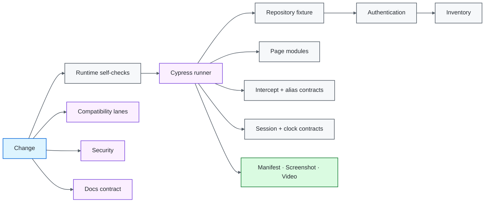

# Cypress UI Quality Engineering Framework

[](https://github.com/portyu9/qa-automation-ui-cypress/actions/workflows/ci.yml)
[](https://github.com/portyu9/qa-automation-ui-cypress/actions/workflows/extended.yml)
[](https://github.com/portyu9/qa-automation-ui-cypress/actions/workflows/security.yml)
[](https://github.com/portyu9/qa-automation-ui-cypress/actions/workflows/docs.yml)

[](https://nodejs.org/)
[](https://developer.mozilla.org/docs/Web/JavaScript)
[](https://www.cypress.io/)
[](https://www.google.com/chrome/)
[](https://www.mozilla.org/firefox/)
[](https://github.com/features/actions)
[](https://trivy.dev/)
[](LICENSE)
[](.github/SECURITY.md)

A Cypress browser quality-engineering framework centered on **native command retryability, explicit test isolation, stable application-owned selectors, deterministic target ownership, bounded evidence, and reproducible CI**. Page modules and custom commands express durable feature/test policy without hiding Cypress command-queue semantics behind a generic wrapper layer.

> [!IMPORTANT]
> Required CI uses a repository-owned loopback application at `http://127.0.0.1:3100`. A deployed environment is selected explicitly with `CYPRESS_BASE_URL`; public-site availability is never part of the framework's definition of health.

**Read by intent:** [capabilities](#capability-map) · [architecture](#architecture) · [quick start](#quick-start) · [native command surface](#native-command-queue-capability-surface) · [synchronization](#synchronization-model) · [network policy](#network-stubbing-policy) · [cross-origin policy](#cross-origin-policy) · [security](#security-and-supply-chain) · [dependencies](#dependency-maintenance) · [triage](#failure-triage)

## Capability map

| Plane | What it proves | Execution | Evidence |
| --- | --- | --- | --- |
| Runtime contract | Configuration, reporter, evidence, and workflow-pin policy | Node self-tests | Assertions + exit status |
| Primary browser | Authentication acceptance/rejection and page transitions | Node 24.20.0 + Chrome + local fixture | Reconciled run manifest, screenshots, video |
| Native command orchestration | Aliased interception, tasks, session caching/validation, request setup, deterministic clocks | Cypress command queue + local fixture | Native command/assertion output |
| Browser compatibility | Alternate-browser behavior without changing runtime generation | Node 24.20.0 + Firefox | Independent browser evidence |
| Runtime compatibility | Maintenance-LTS behavior without changing primary browser | Node 22.23.2 + Chrome | Independent runtime evidence |
| Controlled dependency | UI behavior under owned network conditions | `cy.intercept()` when justified | Native command/assertion output |
| Security | SAST, npm advisories, dependency/configuration/secret risk, and PR dependency-change risk | CodeQL + npm Audit + Trivy + Dependency Review when available | Actions status + machine-readable security evidence |
| Documentation | README/workflow/governance consistency | Repository-local validator | Actions status |

## Architecture



## Engineering invariants

| Concern | Framework contract |
| --- | --- |
| Default target | Browser gates use repository-owned `http://127.0.0.1:3100`. |
| Fixture lifecycle | `setupNodeEvents` starts the fixture for the default target; `after:run` closes it. |
| External integration | Non-default `CYPRESS_BASE_URL` is explicit and separately attributable. |
| Command ownership | Cypress owns scheduling/retryability; helpers return or enqueue native commands rather than inventing a second async model. |
| Selectors | Stable `data-test` hooks are the primary automation interface. |
| Synchronization | Cypress retryability + observable state replace elapsed-time sleeps. |
| Isolation | `testIsolation: true`; predecessor state is never a test prerequisite. |
| Session reuse | `cy.session()` must include a validation contract when cached state matters. |
| Time control | `cy.clock()`/`cy.tick()` replace real elapsed time when timer behavior itself is under test. |
| Sensitive input | Password operations suppress Cypress command logging. |
| Negative behavior | Rejection/error semantics are first-class executable contracts. |
| Retries | Bounded run-mode retries are diagnostics, not the definition of correctness. |
| Evidence | `after:run` writes an atomic privacy-aware run manifest; required lanes reconcile aggregate/per-test state, require at least five actually executed tests, reject disabled tests, and reject retry-recovered passes. |
| Compatibility | Node 24.20.0 + Chrome is primary; Node 24.20.0 + Firefox isolates browser risk; Node 22.23.2 + Chrome isolates maintenance-LTS runtime risk. |
| Toolchain | npm 11.19.1 is installed and then asserted exactly before dependency work in required Node lanes. |
| Workflow supply chain | External Actions are full-SHA pinned and the repository executes a pin contract rather than relying on convention. |
| Security | CodeQL, npm Audit, Trivy, and change-aware dependency review remain independent from browser-test retries. |

## Boundary decision guide

| Question | Preferred surface | Reason |
| --- | --- | --- |
| UI rendering/navigation/input? | Cypress browser test | Browser semantics are material |
| Request-driven UI readiness? | Alias request + assert resulting UI | Synchronize to causal events |
| Controlled dependency failure? | `cy.intercept()` | Own the exact dependency condition |
| Setup not under test? | `cy.request()` / API-state boundary | Avoid expensive UI setup |
| Reusable authenticated/browser state? | `cy.session()` + validation | Cache state without weakening correctness |
| Timer/expiry behavior? | `cy.clock()` + `cy.tick()` | Control time rather than sleeping |
| Browser compatibility? | Node 24 + Firefox extended lane | Hold the current-LTS runtime stable while changing browser |
| Node runtime compatibility? | Node 22 + Chrome extended lane | Hold the primary browser stable while changing runtime generation |
| Cross-origin browser flow? | `cy.origin()` when the product actually crosses origins | Cypress must explicitly switch origin execution context |
| Real deployment behavior? | Explicit `CYPRESS_BASE_URL` | Separate environment from framework correctness |

## Repository map

```text
.
├── .github/
│   ├── scripts/
│   └── workflows/
├── config/
├── cypress/
│   ├── e2e/
│   ├── fixtures/
│   ├── pages/
│   └── support/
├── docs/
└── fixture/
```

The repository map intentionally contains directories only. Root files hold configuration and dependency metadata rather than being duplicated here.

## Quick start

```bash
npm ci --ignore-scripts
npm run cypress:install
npm run config:check
npm run cypress:verify
npm run test:chrome
python .github/scripts/validate_readme.py
```

No application process is required for the default run; Cypress owns the fixture lifecycle.

```bash
# browser compatibility
npm run test:firefox

# explicit integration target
CYPRESS_BASE_URL=https://test.example.internal npm run test:chrome
```

<details>
<summary><strong>Target classes</strong></summary>

| Target class | Purpose | Required CI? |
| --- | --- | ---: |
| Repository fixture | Deterministic framework/browser contract | Yes |
| `cy.intercept()` condition | Controlled dependency scenario | When behavior requires it |
| Explicit deployed target | Environment/integration contract | No |

</details>

## Runtime configuration

| Variable | Purpose | Default |
| --- | --- | --- |
| `CYPRESS_BASE_URL` | Application target | `http://127.0.0.1:3100` |
| `CYPRESS_COMMAND_TIMEOUT_MS` | Command/assertion retry budget | `10000` |
| `CYPRESS_REQUEST_TIMEOUT_MS` | Request connection budget | `10000` |
| `CYPRESS_RESPONSE_TIMEOUT_MS` | Response budget | `30000` |
| `CYPRESS_PAGE_LOAD_TIMEOUT_MS` | Page-load budget | `60000` |
| `TEST_RUN_ID` | Run/evidence correlation | generated / CI run ID |

URLs must be absolute HTTP(S), contain no credentials, query strings, or fragments, and fail validation before browser execution.

## Deterministic application fixture

`fixture/server.js` supplies `/health`, `/`, `/inventory.html`, the deterministic capability page, and deterministic accepted/rejected authentication. It intentionally has no public APIs, third-party assets, DNS, or TLS dependencies.

The fixture is **not** a second product or web framework. It exists to prove Cypress-specific behavior—navigation, selectors, input handling, page transitions, negative behavior, command-queue orchestration, artifacts, and browser compatibility—under a controlled contract.

## Page modules and selectors

Page modules expose domain actions and owned locators, not renamed Cypress commands.

```js
cy.get('[data-test="login-button"]').click();
cy.get('[data-test="inventory-item"]').should('have.length.at.least', 1);
```

Application-owned semantic/test hooks are more stable than CSS styling classes or DOM-depth selectors because their purpose is explicit.

## Native command-queue capability surface

`cypress/e2e/capabilities.cy.js` keeps first-class Cypress behavior executable instead of merely listing APIs:

- `cy.stubJson()` builds an owned `cy.intercept()` response, requires a meaningful alias, and keeps the underlying interception visible;
- `cy.wait('@alias')` proves request method/status/body before the UI assertion, preserving causal attribution;
- `cy.task()` exercises the browser-to-Node plugin boundary without using it as a hidden assertion channel;
- `cy.session()` restores browser state only with an explicit `validate()` callback that proves the environment is still usable;
- `cy.request()` performs non-UI validation/setup where browser rendering is not the subject;
- `cy.clock()` and `cy.tick()` prove timer transitions at exact boundaries with no real-time sleep.

The point is not API count. The point is that Cypress's queue, retryability, browser state, Node boundary, network interception, and fake-time model remain visible and testable.

## Synchronization model

Use Cypress queries and `.should()` as the primary readiness mechanism. For request-driven behavior, wait on the actual request/response and then assert the resulting UI state.

```js
cy.wait(3000); // anti-pattern: elapsed time is not a system condition
```

A useful timeout explains **which observable state never became true**.

## Authentication and sensitive input

The suite proves both accepted and rejected credentials. Password typing uses `{ log: false }`; this reduces command-log exposure but does not make real credentials appropriate test data. Deployed credentials belong in secure environment-specific configuration.

## Network stubbing policy

`cy.intercept()` is appropriate when the test owns a dependency condition—error, latency, request shape, or deterministic response. It should not be used to stub away every integration and create a browser suite that can only prove its own mocks.

A reusable stub helper is justified only when it enforces stable response policy. Assertions should continue to inspect Cypress's native interception objects so request/response semantics are not hidden.

## Cross-origin policy

The deterministic fixture is intentionally single-origin. That keeps required CI focused on framework health rather than inventing an SSO topology the repository does not need.

Modern Cypress requires `cy.origin()` when commands in a single test must execute after navigation to a different origin. Add a deterministic second-origin fixture and `cy.origin()` contract when the application genuinely owns cross-origin authentication, payment, admin, or federated flows; do not add cross-origin complexity simply to increase command coverage.

## Evidence and CI

Cypress-native screenshots/video remain authoritative. `config/runReporter.js` adds a compact run-level manifest, while CI emits run ID, browser, Node runtime, commit/ref, target class, and final status. Required lanes independently reconcile aggregate counts against per-test terminal states, require at least five actually executed tests, reject pending/skipped tests, and reject retry-recovered passes. A green artifact uploader therefore cannot substitute for executed browser work.

Primary CI runs **Node 24.20.0 + Chrome** after runtime/reporter/workflow-pin checks and Cypress binary verification. `extended.yml` changes one compatibility dimension at a time: **Node 24.20.0 + Firefox** isolates browser compatibility, while **Node 22.23.2 + Chrome** isolates maintenance-LTS runtime compatibility. npm **11.19.1** is asserted exactly in every Node lane.

Stable workflow conclusions are intentionally small even when internal jobs evolve: `ci / ci-gate`, `extended / extended-gate`, and `security / security-gate` aggregate their applicable required work. Repository rules/settings are a separate governance layer and are not implied by these workflow contracts.

Generic evidence must not retain credentials, raw authorization headers, cookies, or arbitrary response payloads.

## Security and supply chain

`security.yml` runs four independent control planes: CodeQL JavaScript/TypeScript SAST; npm HIGH/CRITICAL advisory gating over the committed dependency graph; Trivy HIGH/CRITICAL repository dependency/configuration/secret scanning; and pull-request Dependency Review when GitHub Dependency graph is available.

If GitHub Dependency graph is unavailable, the workflow records that limitation while npm Audit and Trivy remain independent required gates. Neither whole-repository scanner is represented as equivalent to change-aware dependency-diff analysis. Security failures are separate from browser flakiness and must not be made green by increasing Cypress retries.

GitHub Actions used by required workflows are pinned to immutable commit identities, and `config/workflowPins.selftest.js` makes that policy executable. The npm lockfile, lifecycle-script-disabled dependency installation, explicit Cypress binary installation, Cypress binary verification, npm Audit, CodeQL, Trivy, and dependency-diff review cover different supply-chain failure modes and are intentionally not treated as substitutes.

## Dependency maintenance

Dependabot maintains **npm** and **GitHub Actions**.

- weekly Monday 09:00 America/New_York schedule;
- grouped minor/patch updates reduce low-risk PR noise;
- majors remain standalone to isolate Cypress/Node/API compatibility changes;
- Actions are reviewed as executable dependencies and the pin contract rejects mutable workflow refs;
- automated updates are evaluated by runtime self-tests, current-LTS Chrome coverage, applicable Firefox/maintenance-LTS compatibility coverage, security, and docs workflows.

Automation proposes a change; deterministic browser/runtime evidence and release-impact review decide whether it is safe.

## Failure triage

| Signal | First interpretation |
| --- | --- |
| Runtime self-test | Configuration/reporting contract |
| Fixture connection | Repository fixture lifecycle/port ownership |
| `cy.visit()` | Navigation/HTTP/page-load boundary |
| Selector timeout | UI contract/readiness |
| Alias/interception mismatch | Request causality/network contract |
| Session validation failure | Cached state/environment invalidation |
| Clock/timer mismatch | Application timing semantics |
| Node task failure | Plugin-process boundary |
| Invalid-login mismatch | Rejection/error semantics |
| Firefox-only failure | Browser compatibility on the current-LTS runtime |
| Node-22/Chrome-only failure | Maintenance-LTS runtime compatibility |
| Retry-only pass | Reliability defect |
| Evidence floor/count failure | Test discovery, disabled tests, or reporter integrity |
| External-target-only failure | Environment/integration first |
| CodeQL | Source-level security defect |
| npm Audit | Known advisory in the npm dependency graph |
| Trivy | Dependency/configuration/secret risk |
| Dependency Review | Newly introduced dependency risk or unavailable Dependency graph |
| Docs | Documentation/governance contract |

## Explicit anti-patterns

- required CI against a public demonstration website;
- fixed `cy.wait(number)` readiness;
- disabled test isolation to preserve predecessor state;
- cached sessions without validation when validity matters;
- styling/DOM-depth selectors as primary contracts;
- blanket `cy.intercept()` stubbing;
- hidden auth setup when authentication is under test;
- real-time waits for deterministic timer behavior;
- retries used to normalize unexplained flakiness;
- credentials or arbitrary response bodies in generic evidence;
- treating a whole-repository vulnerability scan as equivalent to dependency-diff review;
- multiplying browser/runtime matrices without a specific compatibility risk.

## Design references

- [`docs/ARCHITECTURE.md`](docs/ARCHITECTURE.md) — runtime, fixture, runner, page, and evidence boundaries.
- [`docs/TEST_STRATEGY.md`](docs/TEST_STRATEGY.md) — layer selection, browser/runtime policy, isolation, negative testing, security, and exit criteria.
- [`CONTRIBUTING.md`](CONTRIBUTING.md) — change-quality expectations.

A strong Cypress framework makes the failing boundary obvious: **runtime configuration, fixture lifecycle, command/network/state orchestration, navigation, browser compatibility, Node runtime compatibility, selector/readiness, application behavior, security, or explicit environment integration**.
