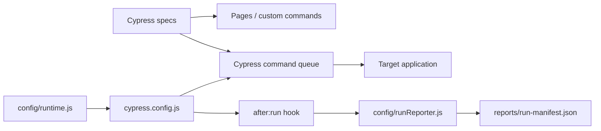

# Architecture

## Design objective

The Cypress framework keeps test intent close to Cypress while centralizing only cross-cutting execution policy: validated runtime configuration, a small command/page surface, test isolation, retry settings, and privacy-aware run reporting.

Custom commands and page objects should model repeated application intent. They should not replace ordinary Cypress commands with a second generic API.

## Runtime configuration boundary

`config/runtime.js` validates environment-derived policy before Cypress execution.

`CYPRESS_BASE_URL` must be an absolute HTTP(S) URL without:

- URL credentials;
- query strings;
- fragments.

Optional path prefixes remain valid. Command/request/response/page-load budgets must be positive integers. The generated/runtime run ID is passed into Cypress environment state for correlation.

`config/runtime.selftest.js` verifies these invariants without starting a browser. It is part of `npm run config:check` and runs before the config is loaded by CI.

## Cypress execution model

Cypress command retryability and assertion semantics remain native. The framework does not add arbitrary Promise wrappers or sleeps around Cypress commands.

`testIsolation: true` is the default. Each test should establish the application state it depends on rather than relying on execution order or state leaked from a prior spec/test.

Retries are enabled only in run mode and capped. A retry-only pass remains a reliability signal.

## Selector and page model

Prefer stable test IDs and user-facing semantic selectors. Pages expose feature-level interactions; custom commands are reserved for truly shared operations such as authenticated setup or test-ID lookup.

Do not create generic `click(selector)`/`type(selector)` wrappers that hide Cypress's own retryability and error context.

## Run reporter

`config/runReporter.js` consumes Cypress's supported `after:run` results object and builds an atomic run manifest containing:

- schema version and run ID;
- sanitized base URL;
- browser/OS/Cypress version;
- aggregate test totals/duration;
- per-spec stats;
- per-test final state, attempt count, and bounded failure message.

The manifest is written to a temporary file and atomically renamed. The reporter can be tested independently from Cypress with `config/runReporter.selftest.js`.

## Diagnostic privacy

The run reporter sanitizes data **before persistence**:

- base URL user-info/query/fragment are removed;
- URLs embedded in error text are reduced to origin/path;
- common bearer/basic values are redacted;
- common token/password/secret assignments are redacted;
- failure text is bounded.

Screenshots/video remain native Cypress evidence and can contain application-visible content. Use synthetic data and controlled accounts; structured run-manifest redaction does not sanitize pixels or arbitrary DOM content.

## Node-event boundary

`setupNodeEvents` is the correct boundary for filesystem/reporting behavior. Browser-side spec code should not own CI artifact serialization. Node tasks should remain allowlisted and narrow so privileged filesystem/process access does not leak into test code unnecessarily.

## CI evidence

CI runs configuration/reporter self-tests, verifies Cypress installation, executes the Chrome gate, and publishes reports/screenshots/video when present.

The zero-browser self-tests classify framework policy failures separately from browser/application failures, making the pipeline easier to diagnose.

## Extension rules

New framework behavior should:

1. validate runtime input before browser startup;
2. preserve native Cypress command/assertion semantics;
3. keep custom commands/pages feature-oriented and small;
4. maintain test isolation and explicit state setup;
5. use Node events for filesystem/reporting concerns;
6. sanitize and bound structured diagnostics before persistence;
7. add a zero-browser self-test when reporter/config logic is independently testable;
8. treat retry-only passes as reliability signals rather than expected behavior.
