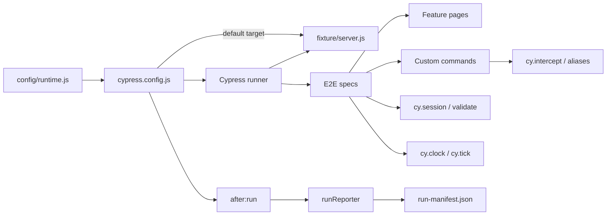

# Architecture

## Design objective

The framework keeps browser behavior native to Cypress while centralizing cross-cutting execution policy: validated runtime configuration, deterministic target ownership, feature page modules, explicit command/state contracts, test isolation, bounded retries, and privacy-aware run reporting.

The repository fixture exists to make framework validation independent of public-network availability. It is not a second general-purpose application framework.

## Runtime configuration boundary

`config/runtime.js` validates `CYPRESS_BASE_URL`, timeout budgets, and run correlation before Cypress starts browser work. URLs must be absolute HTTP(S), contain a hostname, and contain no credentials, query, or fragment.

Operator-provided `TEST_RUN_ID` values are trimmed and constrained to 1–128 ASCII letters, digits, dots, underscores, colons, or hyphens. Unsafe whitespace/control characters and overlong tokens fail before they can become report/evidence identity.

The default base URL is `http://127.0.0.1:3100`. A different value explicitly selects a deployed target.

## Fixture lifecycle boundary

`fixture/server.js` owns a deterministic authentication/inventory application using Node's built-in HTTP server. `setupNodeEvents` starts it only when the configured base URL equals the default fixture URL. `after:run` closes it after writing the run manifest.

This produces three distinct execution modes:

1. repository fixture — required deterministic framework/browser contract;
2. `cy.intercept()` — targeted controlled dependency behavior;
3. explicit deployed base URL — environment/integration contract.

Do not blur these modes. A public environment outage is not a Cypress framework regression.

## Cypress execution model

Cypress command retryability, assertions, navigation behavior, screenshots/video, and test isolation remain native. The framework does not wrap ordinary Cypress commands with another asynchronous abstraction.

Custom commands return their terminal Cypress chain so composition remains explicit to callers. `stubJson()` validates a non-empty alias without the `@` prefix and returns the native `cy.intercept(...).as(...)` chain rather than hiding command-queue ownership.

`testIsolation: true` is mandatory. Run-mode retries are capped and remain a reliability diagnostic signal.

## Native command and state contracts

`cypress/e2e/capabilities.cy.js` exercises stateful Cypress features against the repository fixture:

- `cy.intercept()` through the narrow `cy.stubJson()` helper;
- alias ownership and `cy.wait('@alias')` inspection;
- retryable DOM assertions after intercepted network behavior;
- `cy.task()` for an allowlisted Node-side operation;
- `cy.session()` with an explicit `validate()` request so cached browser state is never trusted without a health contract;
- `cy.request()` below the browser when an HTTP health assertion is sufficient;
- `cy.clock()`/`cy.tick()` for deterministic timer behavior instead of elapsed wall-clock sleeps.

Session state, intercept aliases, and clock ownership belong to the test/suite that creates them. They are capabilities, not reasons to create a second framework abstraction.

## Cross-origin policy

The committed fixture is intentionally single-origin. Add a deterministic second-origin fixture and `cy.origin()` only when the application has a real cross-origin requirement such as federated identity, payment handoff, or another separately owned origin.

Cross-origin behavior should not be simulated by weakening browser security policy or by adding an external public dependency to required CI.

## Selector and page model

Stable `data-test` hooks are the primary application test interface. Page modules expose feature intent and locator ownership. Avoid generic `click(selector)` or `type(selector)` wrappers that erase Cypress command context.

Authentication password entry suppresses command logging. Shared diagnostics must not contain credentials, cookies, or arbitrary response bodies.

## Node event boundary

Node events own privileged process/filesystem responsibilities:

- local fixture lifecycle;
- allowlisted logging task;
- run-manifest serialization.

Browser-side spec code should not own CI artifact writing or process lifecycle.

## Run reporter

`config/runReporter.js` maps Cypress's supported `after:run` result object into an atomic manifest containing run identity, sanitized target, browser/OS/runtime information, totals, spec summaries, final test state, attempt count, and bounded failure text.

Reporter/config logic is self-tested without a browser so framework-policy failures are distinguishable from browser failures.

## Diagnostic privacy

Structured evidence is sanitized before persistence. URLs lose credentials/query/fragment, common credential assignments are redacted, and failure text is bounded. Native screenshots/video can still contain application-visible content; controlled synthetic data remains required.

## Parallelism and port ownership

The fixture uses loopback port `3100`. One Cypress process owns that fixture for its run. CI browser matrix cells run on independent runners, so they do not compete for the port.

If parallel Cypress processes are intentionally run on the same host, each must use an explicitly isolated target/port rather than silently sharing mutable fixture state.

## CI evidence boundary

Primary CI validates configuration/reporter policy, verifies the Cypress binary, executes Chrome against the repository fixture, and retains run evidence. Extended CI executes Chrome and Firefox independently against the same deterministic contract.

Each workflow has least-privilege permissions, concurrency cancellation, bounded job time, and an independent Trivy gate for vulnerability, misconfiguration, and committed-secret findings.

## Extension rules

New framework behavior should:

1. validate external input before browser startup;
2. preserve native Cypress command/assertion semantics and return command chains from custom commands;
3. keep the default CI target repository-owned and deterministic;
4. use Node events for process/filesystem lifecycle concerns;
5. keep page modules feature-oriented and small;
6. maintain test isolation and explicit session/intercept/clock ownership;
7. sanitize and bound structured diagnostics before persistence;
8. add zero-browser tests when config/reporter logic can be separated from the browser;
9. add cross-origin infrastructure only for a real multi-origin requirement;
10. classify deployed-environment tests separately from required framework CI.
